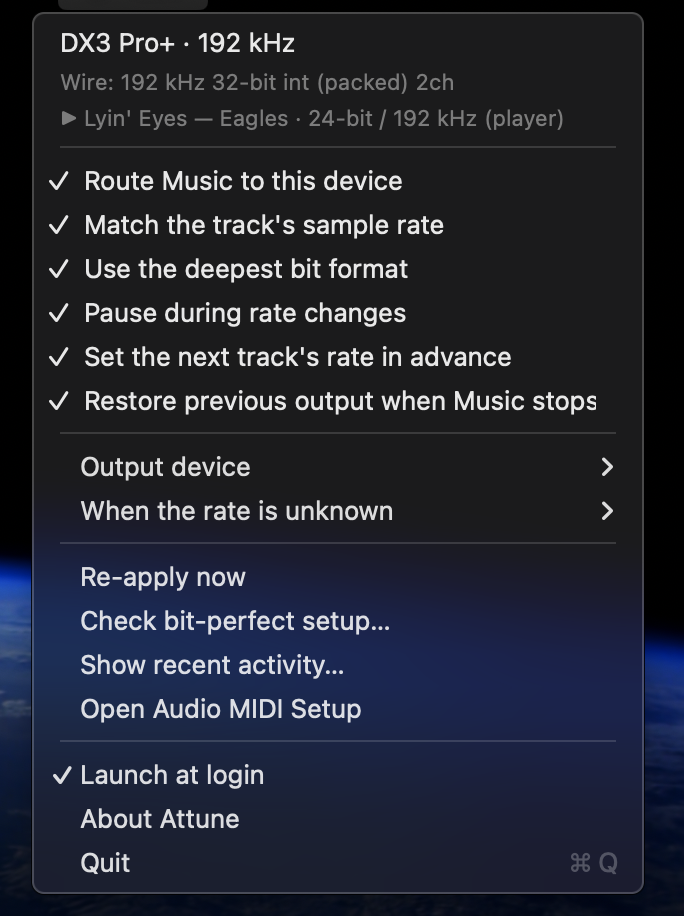

# Attune

A macOS menu bar app. When **Music** starts playing, it sends the audio to your DAC and puts
the DAC on the **track's own sample rate**, so macOS resamples nothing on the way.

Without it the DAC sits at one rate — usually whatever someone last set — and everything
else goes through CoreAudio's sample rate converter before it gets there.

Works with any wired DAC. It was written against a Topping DX3 Pro+, which turns up as an
example here and there, but nothing in the code knows about that device.

## The rest of the documentation

This page is enough to install it and see it work. Everything else lives beside it,
split by why you would open it:

- **[Living with it](docs/using.md)** — permissions, which DAC it picks, and the settings that matter
- **[How it works](docs/how-it-works.md)** — how a track's rate is found, remembered and applied ahead of time
- **[What to expect](docs/limits.md)** — how it compares to what already exists, what it will not do, what it costs to run
- **[When something is wrong](docs/troubleshooting.md)** — symptoms first, then the tools that answer what symptoms cannot
- **[Working on it](docs/development.md)** — the shape of the source, the tests, and how to add a language
- **[Changelog](CHANGELOG.md)** — what changed in each version

## Requirements

| | |
|---|---|
| macOS | 13 or later (it uses `SMAppService`) |
| Xcode Command Line Tools | `xcode-select --install` — full Xcode is not needed |
| A wired DAC | USB, Thunderbolt or FireWire. See [Which DAC it uses](docs/using.md#which-dac-it-uses) |
| Apple Music | The app follows Music, and does not play anything itself |

Nothing else. There is no Xcode project, no package manager, and no dependencies beyond the
system frameworks.

## Installing

There is no download. Build it yourself — four commands:

```bash
git clone https://github.com/zmacario/Attune.git
cd Attune
./tools/create-signing-identity.sh
./build.sh --install
```

Then open Attune from `/Applications` **in Finder**, and tick *Launch at login* in its menu.

A wave icon appears in the menu bar with the current rate beside it (`44.1k`, `96k`…). It
turns **orange** when something is spoiling bit-perfect playback, so you do not have to open
the menu just to check.

**Why build instead of download.** A downloaded app has to be notarized by Apple to open
without a fight, and notarization needs a paid Developer ID. An app you compiled on your own
machine is never quarantined, so none of that applies. It also means you can read what you
are about to run.

**Why the signing identity.** That script creates a self-signed certificate named
`Attune Local` in your keychain. It is optional — skip it and the build signs ad-hoc — but
without it macOS treats every rebuild as a brand new app and asks for the Media & Apple Music
permission again each time. See
[Why rebuilding asks again](docs/using.md#why-rebuilding-asks-for-the-permission-again). The script changes
keychain trust settings, so it will ask for your approval.

To build without installing:

```bash
./build.sh && open "build/Attune.app"
```

`--install` refuses to run while the app is open — quit it from the menu first, or you will
rebuild and carry on using the old copy.

## What it does for each track

1. If the system output is not the DAC, it switches.
2. It works out the track's own rate (details below).
3. It sets the DAC to that rate and raises the wire format to the deepest the device offers.
   Raising depth never makes anything worse: the extra bits arrive as zeros in the least
   significant positions.
4. It warns you if Music's internal volume or its equaliser are spoiling the result.

With *Pause during rate changes* on (the default), it pauses, reconfigures, and resumes where
it left off. Worth it, measured: without the pause, Music keeps running while the DAC
relocks, and the player position advances by exactly the wall clock — **~0.74 s of the music
is skipped** on every change. The pause costs ~0.12 s more silence and loses nothing. The two
sound alike precisely because they last about as long; only one of them keeps the music
whole.

## The menu



```
DX3 Pro+ · 192 kHz                                   ← device and current rate
Wire: 192 kHz 32-bit int (packed) 2ch                ← what goes out on the wire
▶ Lyin' Eyes — Eagles · 24-bit / 192 kHz (player)     ← the track, and where its format came from
─────────────────────────────────────────
☑ Route Music to this device
☑ Match the track's sample rate                      ← clicking does not close the menu
☑ Use the deepest bit format
☑ Pause during rate changes
☑ Set the next track's rate in advance
☑ Restore previous output when Music stops
─────────────────────────────────────────
Output device                                     ▸   ← DACs in a group, updated live
When the rate is unknown                          ▸
─────────────────────────────────────────
Re-apply now
⚠️ Check bit-perfect setup…                          ← the ⚠️ appears only when there is something to fix
Show recent activity…
Open Audio MIDI Setup
─────────────────────────────────────────
☑ Launch at login
Quit
```

Four behaviours that are not obvious from looking:

**The toggles do not close the menu.** An `NSMenu` closes as soon as an item is selected and
there is no way to turn that off, so the six of them became their own views, absorbing the
click — the menu never sees a selection at all. You can set everything in one visit. The real
actions (*Re-apply now*, *Check bit-perfect setup…*, *Quit*) still close, as expected.

**The device list follows the hardware.** Plugging or unplugging a DAC changes the submenu
immediately, even with the menu already open — it is rebuilt from the same CoreAudio
notification that triggers the rerouting. The main menu is still never rebuilt while open,
because that would tear out the row under the pointer; a submenu has its own cycle.

**The header is always three rows, and updates with the menu open.** The fixed count is what
makes updating in place possible: any row that appeared or vanished would push the others up
or down, and a toggle would slide out from under your cursor mid-click. Leave the menu open
across a track change and watch the three rows change with nothing moving.

**The warning lives in the item that resolves it.** Music's internal volume away from 100% or
the equaliser switched on mark *Check bit-perfect setup…* with a ⚠️ and turn the menu bar icon
orange. The detail is in the report, one click away — more informative than a summary line,
and the header stays purely factual.

Music's volume and EQ change without notifying anyone — see
[Periodic checking](docs/using.md#periodic-checking) below.

## License

MIT — see [LICENSE](LICENSE).
