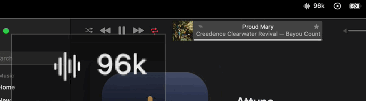

# Attune

A macOS menu bar app. When **Music** starts playing, it sends the audio to your DAC and puts
the DAC on the **track's own sample rate**, so macOS resamples nothing on the way.

Without it the DAC sits at one rate — usually whatever someone last set — and everything
else goes through CoreAudio's sample rate converter before it gets there.

**It works with any wired DAC** — USB, Thunderbolt or FireWire. With more than one
connected it picks by rule: the one you chose in the app, otherwise the most recently
plugged in — and it follows the hardware as devices arrive and leave.

## Watch it work



**A new track opens at its own rate, whole, from its first note.**

A DAC takes a moment to settle on a new rate, so Attune sets the next track's rate while the
current one is still finishing. By the time the new track begins, the DAC is already there.

[The whole thing, thirty-six seconds](https://github.com/zmacario/Attune/releases/download/v1.5/Attune-demo.mp4) —
five tracks at 44.1, 48, 88.2, 96 and 192 kHz, and the rate following each one. No sound.

## The rest of the documentation

This page is enough to install it and see it work. Everything else lives beside it,
split by why you would open it:

- **[Living with it](docs/using.md)** — permissions, which DAC it picks, and the settings that matter
- **[How it works](docs/how-it-works.md)** — how a track's rate is found, remembered and applied ahead of time
- **[What to expect](docs/limits.md)** — how it compares to what already exists, what it will not do, what it costs to run
- **[When something is wrong](docs/troubleshooting.md)** — symptoms first, then the tools that answer what symptoms cannot
- **[Working on it](docs/development.md)** — the shape of the source, the tests, and how to add a language
- **[Changelog](CHANGELOG.md)** — what changed in each version

## Requirements

| | |
|---|---|
| macOS | 13 or later (it uses `SMAppService`) |
| Xcode Command Line Tools | `xcode-select --install` — full Xcode is not needed |
| A wired DAC | USB, Thunderbolt or FireWire. See [Which DAC it uses](docs/using.md#which-dac-it-uses) |
| Apple Music | The app follows Music, and does not play anything itself |

Nothing else. There is no Xcode project, no package manager, and no dependencies beyond the
system frameworks.

## Installing

Build it yourself — four commands:

```bash
git clone https://github.com/zmacario/Attune.git
cd Attune
./tools/create-signing-identity.sh
./build.sh --install
```

Then open Attune from `/Applications` **in Finder**, and tick *Launch at login* in its menu.

A wave icon appears in the menu bar with the current rate beside it (`44.1k`, `96k`…). It
turns **orange** when something is spoiling bit-perfect playback, so you do not have to open
the menu just to check.

**Why build instead of download.** An app you compiled on your own machine is never
quarantined, so it opens without a fight — no Gatekeeper prompt, and no one paying Apple for
a Developer ID to make that true. It also means you can read what you are about to run.

**Why the signing identity.** The third command creates a self-signed certificate named
`Attune Local`, which lets macOS recognise every rebuild as the same app and keep the
Media & Apple Music permission you granted it. It asks for your approval because it touches
keychain trust, and it is optional —
[the detail is here](docs/using.md#why-rebuilding-asks-for-the-permission-again).

To build without installing:

```bash
./build.sh && open "build/Attune.app"
```

## What it does for each track

1. If the system output is not the DAC, it switches.
2. It works out the track's own rate (details below).
3. It sets the DAC to that rate and raises the wire format to the deepest the device offers.
   Raising depth never makes anything worse: the extra bits arrive as zeros in the least
   significant positions.
4. It warns you if Music's internal volume or its equaliser are spoiling the result.

**Not a note of the music is lost.** Attune pauses Music across a rate change and
resumes exactly where it left off, so nothing of the recording is passed over.

## The menu


```
DX3 Pro+ · 192 kHz                                   ← device and current rate
Wire: 192 kHz 32-bit int (packed) 2ch                ← what goes out on the wire
▶ Lyin' Eyes — Eagles · 24-bit / 192 kHz (player)     ← the track, and where its format came from
─────────────────────────────────────────
☑ Route Music to this device
☑ Match the track's sample rate                      ← clicking does not close the menu
☑ Use the deepest bit format
☑ Pause during rate changes
☑ Set the next track's rate in advance
☑ Restore previous output when Music stops
─────────────────────────────────────────
Output device                                     ▸   ← DACs in a group, updated live
When the rate is unknown                          ▸
─────────────────────────────────────────
Re-apply now
⚠️ Check bit-perfect setup…                          ← the ⚠️ appears only when there is something to fix
Show recent activity…
Open Audio MIDI Setup
─────────────────────────────────────────
☑ Launch at login
Quit
```

Four behaviours that are not obvious from looking:

**The toggles do not close the menu.** You can set everything in one visit. The real
actions (*Re-apply now*, *Check bit-perfect setup…*, *Quit*) close, as expected.

**The device list follows the hardware.** Plugging or unplugging a DAC changes the submenu
immediately, even with the menu already open.

**The header updates with the menu open.** Leave it open across a track change and watch
the three rows change with nothing moving.

**The warning lives in the item that resolves it.** Music's internal volume away from 100% or
the equaliser switched on mark *Check bit-perfect setup…* with a ⚠️ and turn the menu bar icon
orange. The detail is in the report, one click away.

Attune keeps an eye on both on its own — see
[Periodic checking](docs/using.md#periodic-checking).

## License

MIT — see [LICENSE](LICENSE).
