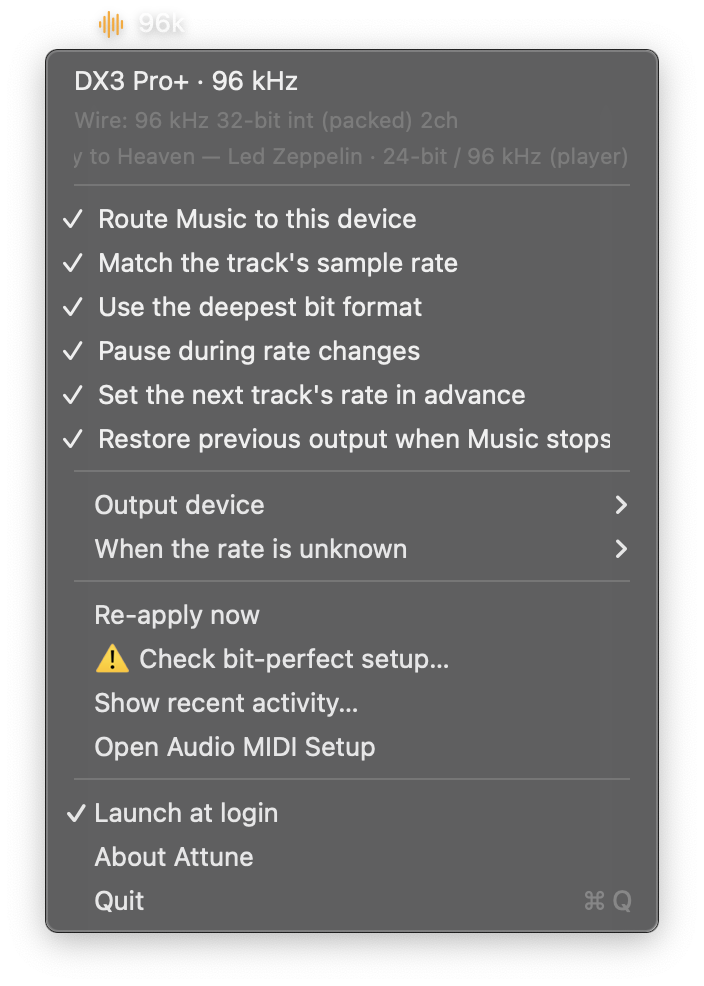
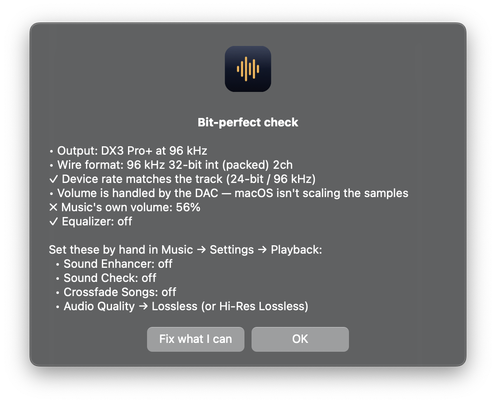

# When something is wrong

Symptoms first, then the tools that answer questions the symptoms do not.

[← back to the README](../README.md)

## When something looks wrong

| What you see | What it usually is |
|---|---|
| The icon is **orange** | Music's own volume is not 100%, or its equaliser is on. Open *Check bit-perfect setup…*, which names the problem and offers to fix both. |
| The rate never changes | Music may not be reaching the app at all. The menu header says `Nothing playing` when that is so — check **Automation → Music** in System Settings, and see [Permissions](using.md#permissions). |
| It asks for Media & Apple Music on every rebuild | You are signing ad-hoc. See [Why rebuilding asks again](using.md#why-rebuilding-asks-for-the-permission-again). |
| The app seems to sit there doing nothing at launch | There is almost certainly a permission dialog waiting behind another window. |
| Streamed tracks all play at 44.1 kHz | The player log is not being read, and every stream is falling back to the configured guess. `Show recent activity…` records why it stood down. |
| A rate change interrupts the new track's first second | *Set the next track's rate in advance* is off, or one of the things it needs is missing — shuffle is on, or that track has not been heard before. |
| The wrong device is being used | Something was chosen in *Output device*, and rule 1 keeps it. `--resolve` prints which rule applied. |
| It is 192 kHz in Music but 96 on the device | The device cannot do that rate. The menu says so, and `--list-devices` lists what each output accepts. |




The warning lives on the item that resolves it, and the menu bar icon turns orange so you do
not have to open the menu to know. The report says which of the two problems it is — here
Music's own volume, which it offers to set back to 100% itself.

`Show recent activity…` in the menu holds the app's recent decisions in plain words, and is
the first place to look for anything not listed here. [Diagnostics](#diagnostics) goes
further.

## Diagnostics

To understand which device the app chose and why:

```bash
"build/Attune.app/Contents/MacOS/Attune" --resolve
```

```
DACs by recency:
    DX3 Pro+  (USB)  connected 16:54:56
    HiBy FC4  (USB)  connected 17:02:11
Chosen in app: DX3 Pro+ — connected
Rule applied: 1. the device chosen in the app
Target: DX3 Pro+
```

It says which of the three rules applied, which is hard to deduce from the result alone.

To follow what the player is reporting, live:

```bash
"build/Attune.app/Contents/MacOS/Attune" --watch-player
```

```
19:54:02  Lossless  44.1 kHz  16-bit  2ch  I/QX.257
20:06:10  Lossless  96 kHz    24-bit  2ch  I/YH.259
```

And to verify the whole cycle without doing anything by hand:

```bash
tools/test-switching.sh 8 1.2      # 8 skips, 1.2 s apart
```

It reinstalls, launches the app, skips tracks through Music and checks whether the DAC ended
on the rate the player last reported — asking the app **which device it is targeting** rather
than assuming one. Assuming was the third false negative this tool produced. The check is
about the **final state**, not about each intermediate reading: skipping faster than the
player reports produces transient mismatches that are expected, while the rate you are left
listening to can never be wrong.

It answers `INCONCLUSIVE` when the player is still talking during the measurement. Without
that it compared the DAC against the format of the track the player was already preparing,
and failed the app when the app was right.

The menu has *Show recent activity…*, which shows the app's recent decisions. From the
command line:

```bash
/usr/bin/log show --last 5m --info --predicate 'subsystem == "com.macario.attune"'
```

Steps that take more than 50 ms record themselves, so slowness shows up in the log without
changing anything. Use `/usr/bin/log` with the full path if you have a `log` function in your
shell.

```bash
"build/Attune.app/Contents/MacOS/Attune" --list-devices
```

Shows the current rate, the wire format, and everything each output accepts. You can leave
**Audio MIDI Setup** open beside it and watch the rate change by itself on each track.

## Removing it

```bash
rm -rf "/Applications/Attune.app"
```

That is the app. Three things outlive it:

**Its settings and the format cache**, under the app's preferences domain. The cache is only
a table of rates and can be dropped without consequence:

```bash
defaults delete com.macario.attune
```

**The login item**, if it was ticked. Untick it in the menu before deleting the app, or
remove it afterwards in **System Settings → General → Login Items**.

**The signing certificate**, if `tools/create-signing-identity.sh` created one. It is called
`Attune Local` in **Keychain Access**, under *login*, and deleting it is a keychain change
like any other — it is left to you rather than scripted here.

macOS keeps the permissions you granted, under **Privacy & Security → Automation** and
**Media & Apple Music**. They do nothing once the app is gone, and reappear as decisions
already made if you install it again.
