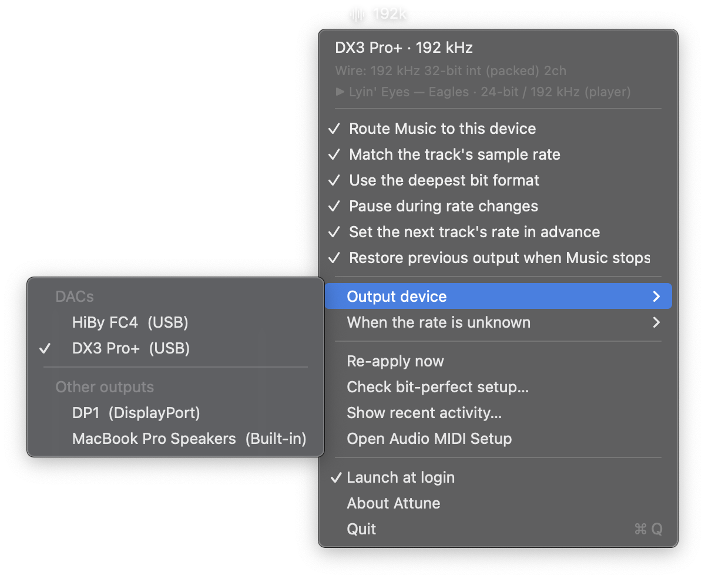

# Living with it

Everything that comes up once it is installed and running.

[← back to the README](../README.md)

## Permissions

On first run macOS asks for two things. Both are needed:

| Permission | What for | If you refuse |
|---|---|---|
| **Automation → Music** | Asking Music what is playing, and pausing/resuming across a rate change | The app cannot tell what is playing; an orange warning appears in the menu |
| **Media & Apple Music** | Reading the track's `.movpkg` to find its real rate | Falls back to guessing the rate |

The second is easy to miss, because the app asks for it on a background thread right at
launch — if the app seems to sit there doing nothing, there is almost certainly a dialog
waiting for an answer. Both live in **System Settings → Privacy & Security**.

**Open the app from Finder**, not from a terminal or a script. macOS attributes permissions
to the process that launched the app, so launching it from another program files the decision
under that program's name and muddles the dialog.

### Why rebuilding asks for the permission again

Ad-hoc signing (`codesign --sign -`) produces a designated requirement like this:

```
designated => cdhash H"edc7fe90…"
```

That hash is the binary's own. Change one line of code and it changes, so every rebuild is a
new app as far as macOS is concerned, and the **Media & Apple Music** permission is asked for
again. **Automation** escapes it, because TCC files client→target pairs by bundle identifier
rather than by hash.

To stop it, sign with a self-signed certificate — the requirement then anchors to the
certificate, which does not change:

```bash
./tools/create-signing-identity.sh
```

`build.sh` finds the certificate by the name `Attune Local` and uses it on its own; without
one it says in the terminal that it signed ad-hoc. You can point it at another with
`CODESIGN_IDENTITY="name" ./build.sh`.

The requirement becomes:

```
designated => identifier "com.macario.attune"
              and certificate leaf = H"b87be2ba…"
```

No cdhash. Verified in practice: rebuilding with a changed binary (different cdhash) and
relaunching produced **no** new `kTCCServiceMediaLibrary` prompt at all, against 7 across the
earlier ad-hoc rebuilds.

**If the script fails at `security import`** with "MAC verification failed": macOS ships
LibreSSL as `openssl`, and it and `security` disagree about how an empty password is encoded
in a PKCS#12 file's MAC. That is why the script generates a random throwaway password instead
of using an empty one — it only carries the private key from openssl to the keychain, and
disappears with the temporary directory.

**If it fails at `add-trusted-cert`**, which alters trust settings and asks for your
approval, you can do it through the interface instead: **Keychain Access → Certificate
Assistant → Create a Certificate**, name `Attune Local`, type *Code Signing*, self-signed.
The name has to match exactly.

## Which DAC it uses

Three rules, in this order:

1. **The device last chosen in the app's menu**, if it is connected.
2. Otherwise, **the most recently connected DAC**.
3. Otherwise, **the built-in speakers**.

The saved device is a preference that breaks ties, not a target the app waits for: unplug it
and another DAC takes over on its own. That is why the tick in the submenu marks the device
**in use** rather than the saved one — the two diverge exactly when the preferred one is away
and another has taken over.



The submenu separates what it will adopt on its own from what it will only use if told:
DACs above, everything else below. The tick marks the device **in use**.

### What counts as a DAC

USB, Thunderbolt and FireWire. Bluetooth and AirPlay are excluded because they resample on
their own and cannot be bit-perfect. DisplayPort and HDMI are excluded from automatic
adoption too — they are wired and they carry digital audio, but they are a monitor or a TV,
not something for the app to adopt unasked. They remain choosable by hand, and a manual
choice applies to any output.

### Connection order

CoreAudio does not report how long a device has been attached, so the app keeps its own
record: a UID that appears where it was not is stamped with the time, and one that vanishes
is forgotten — unplug and replug counts as new. It is stored in the preferences, so the order
survives a relaunch with everything still connected. Devices already present on the first run
tie, and are separated by name so they do not swap places between runs.

### Plugging and unplugging

The app listens on `kAudioHardwarePropertyDevices` and reroutes after 0.3 s — the pause is to
let the HAL settle before asking what is left. It works both ways: unplugging the DAC that is
playing sends the audio to the next one rather than leaving it on the speakers, and plugging
a new DAC in brings it into play at once.

This is **not** the same as the periodic check below. That one updates what the menu shows;
it never reroutes anything. Treating the two as one problem is what left hot-plug unanswered
for a while.

## Periodic checking

The app reacts to `com.apple.Music.playerInfo`, which Music publishes on track change, pause
and resume. But **internal volume and the equaliser publish nothing** — changing either is
invisible to any app outside Music. Without checking now and then, the warning would only
appear when the setting happened to be wrong at the instant a track started, which is exactly
when you do not need it.

So a timer re-reads those two things:

| | |
|---|---|
| Interval | 15 seconds |
| Leeway | 5 seconds, so macOS can group the wakeup with others it would make anyway |
| With Music closed | sends no Apple Event at all; the process check is local |
| Measured cost | 0.0% CPU, and nothing added to the log |

Two decisions keep this from becoming waste. `EngineStatus` is comparable and `publish()`
discards identical updates — otherwise the menu would be rewritten every 15 seconds with
nothing having changed. And the two menu bar images are built once, not on every evaluation.

To change the interval, `pollInterval` and `pollLeeway` are in
[Engine.swift](../Sources/Engine.swift).

## Launch at login

The **Launch at login** item registers the app through `SMAppService` (macOS 13+). What makes
this less trivial than it looks is that `SMAppService` has **four** states, not two:

| State | What the menu shows |
|---|---|
| `.enabled` | "Launch at login", ticked |
| `.requiresApproval` | "Launch at login (approve in System Settings…)" — clicking opens the panel |
| `.notRegistered` | normal; clicking registers |
| `.notFound` | disabled, with a hint to move the app to `/Applications` |

The deceptive case is `.requiresApproval`: macOS accepts the registration but requires you to
confirm it in **System Settings → General → Login Items**. Treating that as "off" — which was
the original behaviour — produced an unticked box that, when clicked, called `register()`
again and changed nothing visible. In that state the click now opens the panel instead of
repeating a registration that already succeeded.

If you register the app through System Settings rather than the menu, the menu sees it and
shows it ticked — it is the same registration.

A trap for anyone working on the code: **`SMAppService.status` blocks indefinitely** when read
outside a properly launched app, and was seen hanging that way during development. That is
why it is read in the background and the menu draws a cached value, rather than consulting it
while building the items.

## Settings you have to change by hand

Music's AppleScript does not expose these, but every one of them breaks bit-perfect playback:

In **Music → Settings → Playback**:

- Sound Enhancer: **off**
- Sound Check: **off**
- Crossfade Songs: **off**
- Audio Quality → **Lossless** or **Hi-Res Lossless**

The menu's *Check bit-perfect setup…* runs the check and shows everything that can be
verified.

## Volume

Leave Music's internal volume at 100% — it attenuates in software, before the audio leaves
the app. The macOS volume control, when the DAC exposes one, is passed through to the
device's own attenuator, and that one you can use freely. The menu's
*Check bit-perfect setup…* says which of the two cases is yours.

## Languages

The interface follows the system language, and falls back to English when there is no
match. Twelve are shipped: English, the five most spoken languages in the world by total
speakers, the five most spoken in Europe that those did not already cover, and Portuguese.

| | | |
|---|---|---|
| `en` | English | |
| `zh-Hans` | Chinese (Simplified) | Mandarin, ~1.18 B speakers |
| `hi` | Hindi | ~609 M |
| `es` | Spanish | ~560 M |
| `ar` | Arabic | ~422 M, right to left |
| `fr` | French | ~310 M |
| `ru` | Russian | most native speakers in Europe, ~106 M |
| `de` | German | ~85 M |
| `it` | Italian | ~58 M |
| `pl` | Polish | ~38 M |
| `uk` | Ukrainian | ~33 M |
| `pt-BR` | Portuguese (Brazil) | the author's |

**These translations have not been reviewed by native speakers.** They are careful, and the
build checks that every key exists in every language and that the format specifiers match —
a `%ld` lost in translation would make `String(format:)` read an argument that was never
passed — but a wording that reads oddly to a native ear would pass both checks. Corrections
are welcome.

**Arabic reads right to left**, and the menu rows are custom views with positions measured
by hand, so they mirror explicitly: the checkmark moves to the trailing edge, the label
aligns and reverses with it, and the scrolling header starts flush right and travels the
other way. There is no automatic mirroring to inherit — a view-backed menu item draws
itself.

Numbers follow the reader too: a rate shows as `44,1 kHz` where that is the convention and
`44.1 kHz` where it is not. Log lines deliberately do not, so a search for `44.1 kHz` keeps
finding them.

**The cache is not affected by any of this**, and that is worth knowing before touching it.
An entry is text — `96000|24` under a key like `id:FD9BD6493A459860` — and everything that
produces or parses it is locale-independent by design: Swift's string interpolation of an
`Int` always writes ASCII digits with no grouping separator, `Double(String)` always expects
a dot, and a hexadecimal key has no decimal separator to disagree about. So a German never
writes `96.000`, an Egyptian never writes `٩٦٠٠٠`, and a cache filled in one language reads
back identically in another. Changing the app's language invalidates nothing.

That is a promise worth pinning rather than assuming, since `String(format:)` in the same
file did produce a decimal point where a comma belonged:

```bash
tools/test-locale-safety.sh
```

It round-trips one entry through eight locales and compares the bytes — Turkish for its
dotless i, Arabic and Hindi for their own digit shapes, German and Russian for the decimal
comma.

Only the interface is translated. Log messages stay in English deliberately — they exist for
diagnosis, and a translated log is harder to search and harder to paste into a bug report.

To see the app in another language without changing the whole system:

```bash
defaults write com.macario.attune AppleLanguages -array pt-BR
```

Quit and reopen the app. To go back to the system language:

```bash
defaults delete com.macario.attune AppleLanguages
```

The same thing exists in the interface, under **System Settings → General → Language & Region
→ Applications**.
